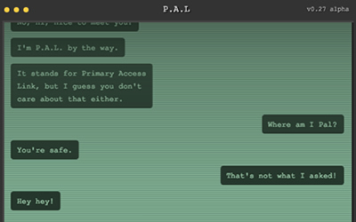

# Lost Time

This is my entry to the 2017 [JS13K](http://js13kgames.com/) competition. It's a Choose Your Own Adventure (CYOA) game written in less than 13 KB. It's also my first game and first canvas app.

[Play It Online](https://cdn.rawgit.com/Dachande663/js13k-2017-lost/master/index.html)

## Overview

JS13K is a competition to produce a game for a given theme within 13 kilobytes. The topic this year was "lost".

This is my first proper game, my first proper use of canvas, and my first attempt at interactive fiction. By day I write code for infrastructure and application back-ends and by night I write speculative fiction, so this was something completely out of my comfort zone. The game itself is a classic Choose Your Own Adventure story, with the player able to pick responses and change the outcome.

## Breakdown

The game is written in plain, vanilla JavaScript using Canvas. It should run on any modern browser, desktop or mobile.

There are two parts to the game:

1. A renderer that draws everything you see including the monitor and all the messages on it. It uses requestAnimationFrame and supports very basic animation. The animation was a late addition, so it's a horrendous bodge using ticks.

2. An s-exp inspired script system where each line contains an action and it's arguments. Each action can then include or trigger other actions. In this way, I can build up the dynamic nature of the story without needing to program each bit. You could even swap the script for another story without needing to change the code itself.

All of the source is available in this repo. Feel free to play and tweak it to your hearts content. All code is released under the MIT License.

## Testing

It's a game written in a few hours for a 13KB competition. There are no tests.

If you want to test the script though, you can access any point in the script via anchor e.g. index.html#a5.

## Build

The build is pretty simple. Minify the JS, minify the HTML, zip. There's a bash script that does it all.

`./build.sh`

You'll need uglify-js and html-minifier from npm to run it.

`npm install uglify-js -g`

`npm install html-minifier -g`

